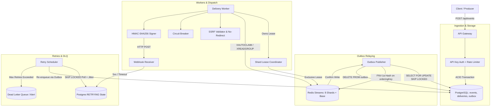

# EventRelay

A distributed webhook delivery engine built with TypeScript, PostgreSQL, and Redis Streams.

[](https://www.typescriptlang.org/)
[](https://nodejs.org/)
[](https://www.postgresql.org/)
[](https://redis.io/)

EventRelay is an asynchronous webhook delivery gateway designed to handle event ingestion, retries, and downstream failure isolation. It uses PostgreSQL as the persistent source of truth with a transactional outbox, Redis Streams for partitioned worker queues, and circuit breakers to prevent flaky destinations from exhausting system resources.

---

## Architecture



### Request Lifecycle
1. **Ingestion**: The gateway authenticates incoming requests (`X-API-Key`), checks an inbound token-bucket rate limiter, and starts a PostgreSQL transaction. It inserts the event with an atomic `ON CONFLICT (idempotency_key) DO NOTHING` guard, queries active subscriber endpoints matching the event type, and creates corresponding `deliveries` and `outbox` records. If no subscriber endpoints match, the event status is marked `NO_TARGETS`.
2. **Outbox Relaying**: A background publisher periodically reads pending outbox entries with `SELECT ... FOR UPDATE SKIP LOCKED`, writes them to Redis Streams, and deletes the outbox rows once Redis confirms receipt.
3. **Partitioned Workers**: Workers acquire exclusive shard leases in Redis (`SET lock:shard:{id} {workerId} NX EX 15`). A worker reads only from shards it currently owns, dispatches HTTP POST requests with HMAC-SHA256 signatures, and acknowledges messages upon completion.
4. **Failure Handling**: Failed deliveries transition to `RETRYING` with an exponential backoff timestamp calculated using full jitter. A background scheduler re-enqueues due retries through the outbox. If retries exceed an endpoint's configured limit, the delivery moves to `DEAD_LETTER`.

---

## Delivery Semantics & Failure Modes

- **At-Least-Once Delivery**: The transactional outbox decouples database persistence from broker publication. Deliveries are committed to PostgreSQL before reaching Redis. If the gateway process crashes mid-ingestion, un-relayed deliveries remain safely in the `outbox` table and are picked up when the service restarts.
- **Per-Shard Sequential Dispatch**: An optional `orderingKey` (e.g., `account_id` or `order_id`) is hashed using 32-bit FNV-1a to one of 8 virtual stream shards. Exclusive shard leases ensure that only one worker dispatches messages from a given shard at a time. Rate-limit backoff waits in-place rather than pushing messages to the tail of the stream to preserve order.
- **Lease Expiry & Reclaim Semantics**: Shard leases have a 15-second TTL with a heartbeat renewal. If a worker hangs on a slow HTTP call or crashes, the lease expires and another worker can claim the shard. Additionally, any unacknowledged message idle in the Redis Pending Entries List (PEL) for >30 seconds is reclaimed via `XAUTOCLAIM`. This means delivery is **at-least-once with best-effort partition serialization**, not distributed consensus or strictly exactly-once FIFO.
- **SSRF Defense**: Registered endpoint URLs and dispatch-time requests are validated against RFC 1918 private subnets, loopback addresses (`127.0.0.0/8`), and cloud metadata services (`169.254.169.254`). HTTP redirects are disabled (`maxRedirects: 0`) to prevent redirect-based SSRF. In production, `ALLOW_PRIVATE_ENDPOINTS` and `ALLOW_HTTP_ENDPOINTS` default to `false`.
- **Circuit Breaker**: Flaky endpoints trip to `OPEN` after 5 consecutive failures, fast-failing subsequent deliveries without network I/O. After a 30-second cooldown, an atomic `HALF_OPEN_PROBING` state lease allows exactly one worker to send a probe request.
- **Database Migrations**: Schema updates are managed by a versioned migration runner (`schema_migrations` table) that runs automatically on startup and can be executed directly via `npm run migrate`.
- **Operator Dashboard**: The frontend is an administrative view for monitoring deliveries, circuit states, and dead-letter queues. The API key is entered by the operator and stored in browser `localStorage` — it is not embedded into client bundles.

---

## Local Development & Setup

### Prerequisites
- Docker and Docker Compose
- Node.js 20+ (optional, for running scripts outside containers)

### 1. Start Services
```bash
docker compose up -d --build
```

Default container ports:
- `eventrelay-backend`: `http://localhost:4000` (internal API)
- `eventrelay-frontend`: `http://localhost:3000` (Nginx serving SPA)
- `eventrelay-mock-receiver`: `http://localhost:9000` (target receiver for testing)
- PostgreSQL: `127.0.0.1:5433`
- Redis: `127.0.0.1:6380`

### 2. Run Database Migrations
Migrations run automatically on backend startup. To run them manually:
```bash
docker compose exec backend npm run migrate
```

### 3. Run Unit Tests (13 Suites, 55 Tests)
```bash
docker run --rm -v "${PWD}/backend:/app" -w /app node:20-alpine npm test
```

### 4. Run End-to-End Verification Suite (50 Checks)
```bash
docker run --rm --network eventrelay_default \
  -e API_BASE="http://eventrelay-backend:4000" \
  -e MOCK_BASE="http://eventrelay-mock-receiver:9000" \
  -e FRONTEND_BASE="http://eventrelay-frontend:80" \
  -e EVENTRELAY_API_KEY=er_secure_local_dev_key_8921 \
  -e ALLOW_PRIVATE_ENDPOINTS=true \
  -e ALLOW_HTTP_ENDPOINTS=true \
  -v "${PWD}:/app" -w /app node:20-alpine node scripts/verify_all.js
```

---

## Benchmarks & Local Performance

Benchmark measured locally using `scripts/load_test.js` against the Docker Compose stack (Node.js 20, PostgreSQL 16, Redis 7 on an AMD Ryzen 7 workstation). The test fires 500 requests at a concurrency of 25, sending both unique and deliberate duplicate idempotency keys with ordering keys:

```bash
docker run --rm --network eventrelay_default \
  -e GATEWAY_URL="http://eventrelay-backend:4000/api/events" \
  -e TOTAL_REQUESTS=500 \
  -e CONCURRENCY=25 \
  -e EVENTRELAY_API_KEY=er_secure_local_dev_key_8921 \
  -v "${PWD}:/app" -w /app node:20-alpine node scripts/load_test.js
```

| Metric | Result |
| :--- | :--- |
| **Ingestion Throughput** | ~225 requests/sec |
| **Total Test Requests** | 500 requests (450 unique, 50 duplicate keys) |
| **Deduplication Accuracy** | 100% (50/50 duplicates detected and returned original ID) |
| **Dropped Events** | 0 |
| **Latency (p50)** | 110 ms |
| **Latency (p90)** | 134 ms |
| **Latency (p99)** | 226 ms |

*Ingestion latency reflects full end-to-end processing per request: API key verification (`timingSafeEqual`), inbound Redis token bucket check, PostgreSQL ACID transaction (`events` insert + `deliveries` insert + `outbox` insert), and background outbox dispatch to Redis Streams.*

---

## Deployment

A deployment script is provided in `scripts/deploy-aws.sh` for single-instance Ubuntu EC2 hosts (`t3.micro` or `t3.small`):

```bash
curl -sSL https://raw.githubusercontent.com/TanmayRawal/EventRelay/main/scripts/deploy-aws.sh | bash
```

The script configures Docker, sets up a 2GB swap partition for memory stability, pulls the repository, generates local credentials in `.env`, and starts the containers.

---

## License
MIT License. Developed by Tanmay Rawal.
