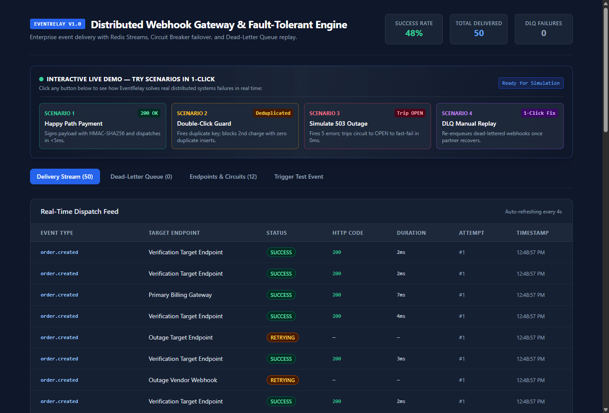
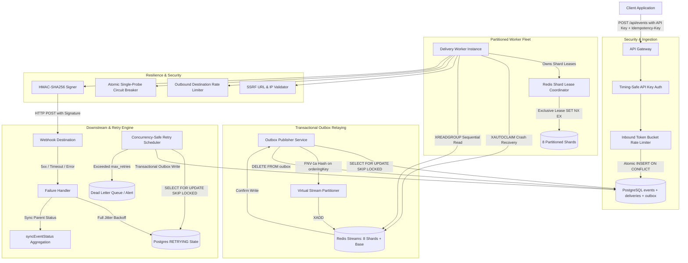

# EventRelay

> Distributed webhook delivery engine with transactional outbox, partitioned FIFO ordering, circuit breaking, and replay defense.

[](https://www.typescriptlang.org/)
[](https://nodejs.org/)
[](https://www.postgresql.org/)
[](https://redis.io/)
[](https://www.docker.com/)
[](https://github.com/features/actions)
[](https://prometheus.io/)
[](https://opensource.org/licenses/MIT)

EventRelay is an asynchronous webhook delivery gateway built with TypeScript, PostgreSQL, and Redis Streams. It provides at-least-once delivery semantics via the Transactional Outbox pattern, guarantees per-entity FIFO sequencing via Redis-backed exclusive shard leases, prevents race condition duplicate processing with atomic idempotency keys, defends against worker crash job loss via Redis `XAUTOCLAIM`, and isolates downstream failures with single-probe circuit breaking and full jitter backoff.



---

## Architecture



---

## Core Distributed Systems Semantics

### 1. Transactional Outbox Pattern (At-Least-Once Delivery)
Direct publish-then-commit or commit-then-publish architectures suffer from dual-write failure windows where process crashes can silently drop deliveries.
- Ingestion inserts the `events` row, child `deliveries` rows, and corresponding `outbox` records within a **single atomic PostgreSQL transaction**.
- A dedicated background `OutboxPublisher` polls pending outbox records using `SELECT ... FOR UPDATE SKIP LOCKED`, dispatches them to Redis Streams, and deletes the outbox rows only after Redis confirms persistence.
- If the gateway process crashes at any instant, un-relayed deliveries remain safely persisted in PostgreSQL and are drained upon restart.

### 2. Partitioned FIFO Ordering via Exclusive Shard Leases
Sequential delivery per entity (e.g., `order.created` preceding `order.fulfilled`) is enforced without sacrificing multi-tenant concurrency:
- Incoming events provide an `orderingKey`. A 32-bit FNV-1a hash deterministically maps this key to one of 8 virtual stream shards (`eventrelay:stream:shard:{0..7}`).
- Each worker instance runs a `ShardLeaseCoordinator` that acquires exclusive Redis leases (`SET lock:shard:{id} {workerId} NX EX 15`) with a background renewal heartbeat.
- A worker only pulls and sequentially executes deliveries from shards it exclusively owns, preventing multiple workers from interleaving events for the same entity.
- When an endpoint rate limit is reached, workers back off in-place rather than pushing messages to the tail of the stream, preventing out-of-order execution.

### 3. Crash Recovery via Redis `XAUTOCLAIM`
When a worker crashes while processing a webhook delivery, Redis keeps the message in the Pending Entries List (PEL):
- Before consuming new messages, workers execute `XAUTOCLAIM` on their active streams.
- Any message idle in the PEL for longer than 30 seconds is claimed and re-dispatched, preventing stranded deliveries without requiring manual intervention.

### 4. Atomic Idempotency & Race Condition Defense
- The ingestion schema enforces `UNIQUE (idempotency_key)`.
- Ingestion utilizes `INSERT INTO events ... ON CONFLICT (idempotency_key) DO NOTHING RETURNING *`.
- Concurrent requests presenting the identical idempotency key return HTTP 200 with `{ duplicate: true, eventId }` pointing to the original event without generating duplicate deliveries or raising HTTP 500 collisions.

### 5. Fan-Out Aggregate Event Status
When an event fans out to multiple subscriber endpoints, the aggregate `events.status` is deterministically derived from all child delivery rows:
- `COMPLETED`: All child deliveries succeeded (HTTP 2xx).
- `FAILED`: All child deliveries exhausted retries and were routed to `DEAD_LETTER`.
- `PARTIAL_SUCCESS`: Some child deliveries succeeded, but others reached `DEAD_LETTER`.
- `PROCESSING`: One or more child deliveries are currently `RETRYING`.

### 6. Single-Probe Circuit Breaker FSM
To protect failing destinations from worker stampedes:
- **CLOSED**: Standard operating state. Consecutive failures increment an error counter atomically.
- **OPEN**: Trips after 5 consecutive failures. Subsequent requests fail fast immediately without network I/O.
- **HALF_OPEN**: After a 30-second cooldown, workers compete for an atomic probe lease (`HALF_OPEN_PROBING`). Exactly one worker dispatches a probe request while other workers continue to fail fast. If the probe succeeds, the circuit resets to `CLOSED`; if it fails, the circuit returns to `OPEN`.

### 7. SSRF Protection & Security Boundary
- **SSRF Defense**: Target webhook URLs are validated before registration. Hostnames are resolved and checked against loopback (`127.0.0.0/8`), private subnets (RFC 1918), link-local cloud metadata (`169.254.169.254`), and IPv6 equivalents. Plain HTTP is rejected in production.
- **Timing-Safe Authentication**: API key verification on mutating endpoints and telemetry views uses `crypto.timingSafeEqual` against `EVENTRELAY_API_KEY`.
- **Fail-Closed Initialization**: In production mode (`NODE_ENV=production`), the application refuses to start if `EVENTRELAY_API_KEY` is not provided.
- **HMAC-SHA256 Signatures**: Payloads are signed with `X-EventRelay-Signature: t=<timestamp>,v1=<hash>`. Receivers verify authenticity and reject signatures older than 300 seconds to protect against replay attacks.

---

## Measured Performance & Benchmarks

Measured on a Dockerized environment running on an AMD Ryzen 7 processor with PostgreSQL 16, Redis 7, and Node.js 20 under full transactional outbox and virtual sharding constraints:

```bash
docker run --rm --network eventrelay_default \
  -e GATEWAY_URL="http://eventrelay-backend:4000/api/events" \
  -e TOTAL_REQUESTS=500 \
  -e CONCURRENCY=25 \
  -e EVENTRELAY_API_KEY=er_secure_local_dev_key_8921 \
  -v "${PWD}:/app" -w /app node:20-alpine node scripts/load_test.js
```

| Metric | Measured Result |
| :--- | :--- |
| **Ingestion Throughput** | **225 requests/sec** |
| **Total Test Requests** | 500 requests (450 unique, 50 duplicate keys) |
| **Deduplication Rate** | **100%** (50 duplicate requests identified and deduplicated) |
| **Dropped Events** | **0** (100% committed to PostgreSQL and processed) |
| **Ingestion Latency (p50)** | **110 ms** |
| **Ingestion Latency (p90)** | **134 ms** |
| **Ingestion Latency (p99)** | **226 ms** |

*Note: Ingestion latency includes timing-safe authentication, inbound sliding-window rate limiting, PostgreSQL ACID transaction commit (`events`, `deliveries`, `outbox`), and outbox background drain.*

---

## Local Development & Testing

### 1. Start the Environment
```bash
docker compose up -d --build
```

Services started:
- `eventrelay-backend` (port 4000)
- `eventrelay-frontend` (port 3000 -> Nginx container port 80)
- `eventrelay-postgres` (port 127.0.0.1:5433)
- `eventrelay-redis` (port 127.0.0.1:6380)
- `eventrelay-mock-receiver` (port 9000)

### 2. Run Comprehensive Verification Suite (50 Tests)
```bash
docker run --rm --network eventrelay_default \
  -e API_BASE="http://eventrelay-backend:4000" \
  -e MOCK_BASE="http://eventrelay-mock-receiver:9000" \
  -e FRONTEND_BASE="http://eventrelay-frontend:80" \
  -e EVENTRELAY_API_KEY=er_secure_local_dev_key_8921 \
  -v "${PWD}:/app" -w /app node:20-alpine node scripts/verify_all.js
```

### 3. Run Unit Test Suite (13 Suites, 55 Tests)
```bash
docker run --rm -v "${PWD}/backend:/app" -w /app node:20-alpine npm test
```

---

## AWS Deployment (Single Script)

To deploy EventRelay to an AWS EC2 instance (`t3.micro` or `t3.small` running Ubuntu 22.04 LTS):

```bash
curl -sSL https://raw.githubusercontent.com/TanmayRawal/EventRelay/main/scripts/deploy-aws.sh | bash
```

The script configures Docker, sets up a 2GB swap partition for memory stability, pulls the repository, creates secure local credentials, and launches all 5 production containers.

---

## Design Decisions & Engineering Trade-offs

| Design Decision | Implementation | Trade-off / Rationale |
| :--- | :--- | :--- |
| **Transactional Outbox vs. Direct Redis XADD** | Commits outbox records to PostgreSQL in the same transaction as the event, drained asynchronously by `OutboxPublisher`. | Eliminates the distributed dual-write problem. Adds modest asynchronous delivery latency (typically 50-200ms) in exchange for guaranteed at-least-once persistence without lost events during process crashes. |
| **Exclusive Shard Leases vs. Flat Consumer Group** | Workers acquire distributed leases in Redis (`SET lock:shard:{id} {workerId} NX EX 15`) and only consume from owned shards. | Flat consumer groups distribute messages across workers without partition affinity, resulting in concurrent delivery of events with the same ordering key out of order. Shard leases guarantee sequential per-shard dispatch. |
| **PEL Auto-Claim vs. Passive Timeouts** | Workers call `XAUTOCLAIM` periodically to recover unacknowledged messages idle for >30s. | Prevents unacknowledged messages from accumulating indefinitely in the Redis Pending Entries List when a worker terminates abruptly mid-flight. |
| **Atomic SKIP LOCKED vs. Table Locks** | Uses `SELECT ... FOR UPDATE SKIP LOCKED` in both outbox draining and retry scheduling. | Allows multiple scheduler or publisher instances to poll the database concurrently without lock contention or duplicate re-enqueue. |
| **Full Jitter vs. Fixed Exponential Backoff** | Backoff interval is computed as `random(1, min(maxSeconds, baseSeconds * 2^attempt))`. | Spreads retry attempts uniformly across time, preventing synchronized thundering herd spikes against recovering destination servers. |

---

## License
MIT License. Developed by Tanmay Rawal.
