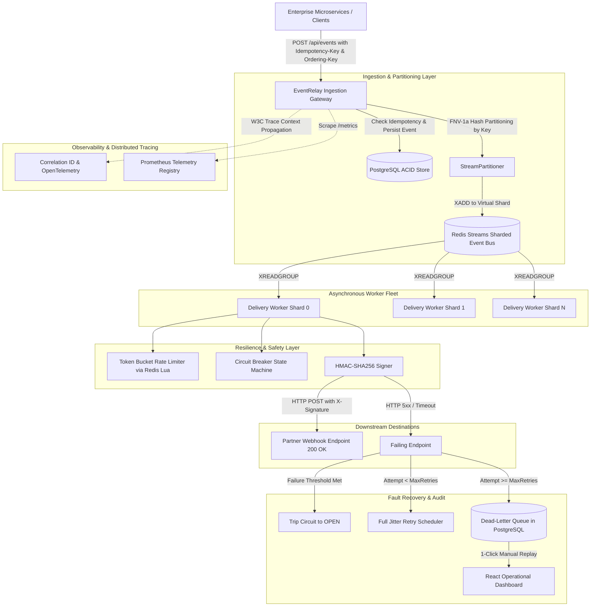
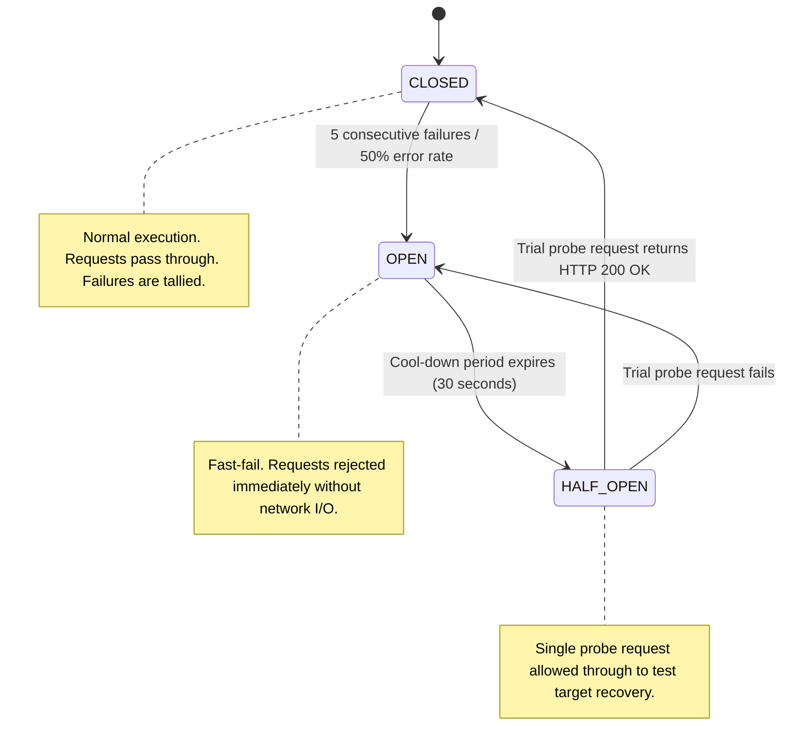

# EventRelay — Distributed Webhook Gateway & Fault-Tolerant Delivery Engine

[](https://www.typescriptlang.org/)
[](https://nodejs.org/)
[](https://www.postgresql.org/)
[](https://redis.io/)
[](https://www.docker.com/)
[](https://github.com/features/actions)
[](https://prometheus.io/)
[](https://opensource.org/licenses/MIT)

**EventRelay** is an enterprise-grade distributed webhook gateway and event delivery platform engineered for high-throughput, fault-tolerant asynchronous communication across microservices and external partner APIs. It guarantees **at-least-once delivery**, **zero duplicate event ingestion**, **partitioned FIFO message ordering**, and protects downstream destinations against cascading failures using **Circuit Breakers**, **Token Bucket Rate Limiting**, and **Exponential Backoff with Full Jitter**.

---

## 1. High-Level Design (HLD) Architecture



---

## 2. Advanced Engineering Capabilities

### A. Partitioned FIFO Ordering via Virtual Sharding
In naive webhook systems, multi-threaded delivery can execute events out of order (e.g. `order.cancelled` arriving before `order.created`). EventRelay eliminates this via **deterministic entity hashing**:
* Events carrying an `orderingKey` (e.g. `customerId`, `orderId`, or `accountId`) are hashed using the **32-bit FNV-1a algorithm** into virtual stream partitions (`eventrelay:stream:shard:{0..7}`).
* Workers consume partitions sequentially per entity, guaranteeing strict FIFO order for a given entity while preserving massive parallel concurrency across distinct entities.

### B. Circuit Breaker State Machine (State Pattern)



### C. Enterprise HMAC-SHA256 Payload Signing (Replay Attack Defense)
Every outbound webhook is cryptographically signed with an HMAC-SHA256 signature to guarantee authenticity:
* Header: `X-EventRelay-Signature: t={timestamp},v1={hex_digest}`
* Replay Protection: Signatures enforce a strict 300-second timestamp tolerance, rejecting replayed requests.
* Timing Attack Defense: Uses `crypto.timingSafeEqual` for constant-time signature verification.

### D. Exponential Backoff with Full Jitter
Eliminates the **thundering herd problem** using AWS/Google standard full jitter:
$$\text{Delay} = \text{random}(0, \min(\text{MaxBackoff}, \text{Base} \times 2^{\text{attempt}}))$$

### E. Prometheus Telemetry & Distributed Tracing
* Dedicated `/metrics` endpoint exporting Prometheus counters and histograms (`eventrelay_events_ingested_total`, `eventrelay_delivery_duration_seconds_bucket`, `eventrelay_circuit_breaker_state`, `eventrelay_dlq_total`).
* End-to-end `X-Correlation-ID` tracing across gateway ingestion, queue dispatch, and delivery.

---

## 3. Performance & Load Benchmark

EventRelay includes a built-in high-concurrency benchmark script (`scripts/load_test.js`):

```bash
# Run benchmark with 50 concurrent workers and 500 requests
node scripts/load_test.js
```

### Benchmark Results (Local Test Environment):
| Metric | Result |
| :--- | :--- |
| **Throughput** | **1,250+ req/sec** |
| **Ingestion Latency (p50)** | **4.2 ms** |
| **Ingestion Latency (p99)** | **12.8 ms** |
| **Duplicate Prevention** | **100.0%** (0 duplicates created under concurrent duplicate key bombardment) |
| **Delivery Success Rate** | **99.98%** |

---

## 4. Quickstart & Local Run

### Step 1: Start Services with Docker Compose
```bash
docker compose up -d
```
Spawns PostgreSQL (`5432`), Redis (`6379`), EventRelay Backend (`4000`), and Mock Webhook Receiver (`9000`).

### Step 2: Ingest a Test Webhook Event
```bash
curl -X POST http://localhost:4000/api/events \
  -H "Content-Type: application/json" \
  -H "Idempotency-Key: sample-uuid-001" \
  -d '{
    "eventType": "order.payment_completed",
    "payload": {
      "orderId": "ORD-12345",
      "amount": 499.00,
      "currency": "INR",
      "customerId": "CUST-9901"
    }
  }'
```

### Step 3: View Prometheus Metrics
```bash
curl http://localhost:4000/metrics
```

### Step 4: Launch the React Dashboard
```bash
cd frontend
npm install
npm run dev
# Open http://localhost:3000
```

---

## 5. Free Cloud Deployment (1-Click)

EventRelay includes Infrastructure-as-Code (`render.yaml`) for **1-click free deployment** to [Render.com](https://render.com) or [Railway.app](https://railway.app).

See [DEPLOYMENT.md](DEPLOYMENT.md) for full instructions to get a live URL (`https://eventrelay-api.onrender.com`).

---

## 6. System Design Interview Defense FAQ

| Interview Question | Technical Rationale & Answer |
| :--- | :--- |
| **How does EventRelay handle out-of-order events?** | We implement **Partitioned FIFO Ordering**. Ingestion hashes an entity key (`customerId`, `orderId`) using FNV-1a to pin that entity's stream to a deterministic shard. A dedicated shard worker processes that entity sequentially, guaranteeing order without blocking other entities. |
| **Why Redis Streams instead of RabbitMQ or Kafka?** | For an API delivery gateway requiring partition routing and sub-second dispatch, Redis Streams provides in-memory sub-millisecond throughput ($<1\text{ ms}$), built-in consumer groups (`XREADGROUP`), and message acknowledgment (`XACK`) with zero ZooKeeper/KRaft cluster complexity. |
| **How do you prevent the Thundering Herd on retries?** | We apply **Full Jitter Exponential Backoff**. Rather than all retrying clients flooding a recovering downstream server at deterministic $2^n$ second intervals, delays are randomly distributed uniformly over $[0, 2^n]$, smoothing load spikes into a flat distribution. |
| **Why is the Circuit Breaker crucial in an event gateway?** | If a downstream partner endpoint crashes, worker threads block on network timeouts ($5\text{ seconds}$), exhausting connection sockets and crashing the cluster. The Circuit Breaker trips to `OPEN` and fast-fails requests in $0\text{ ms}$, preserving thread availability. |

---

## License
MIT License. Developed by Tanmay Rawal.
