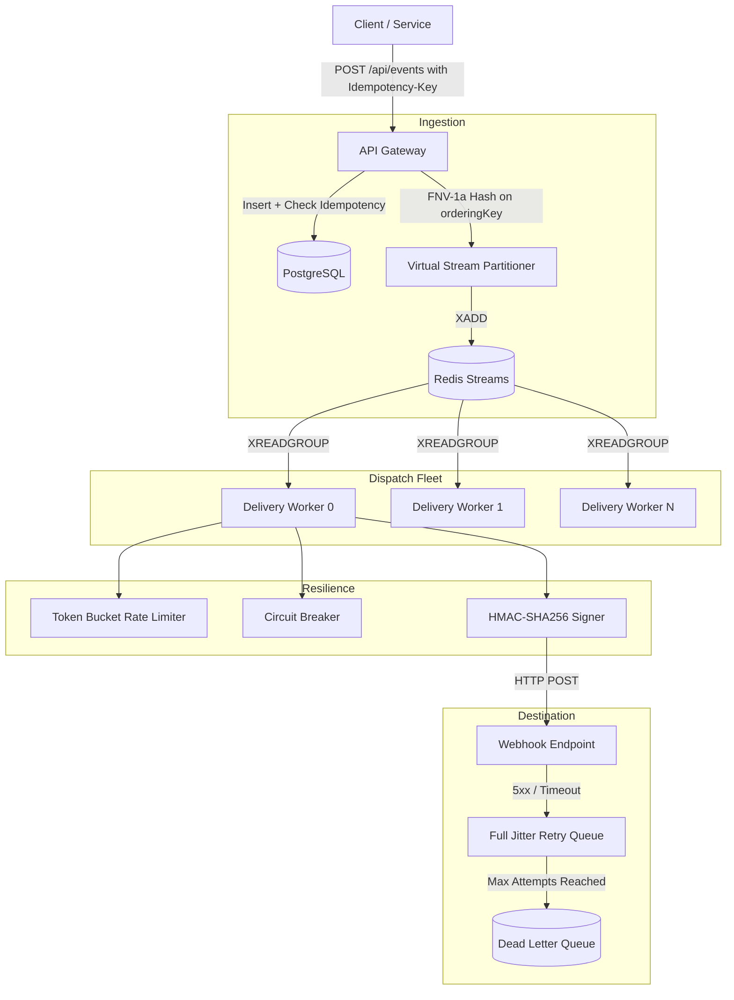

# EventRelay

> Distributed webhook delivery engine with partitioned FIFO ordering, circuit breaking, and replay defense.

[](https://www.typescriptlang.org/)
[](https://nodejs.org/)
[](https://www.postgresql.org/)
[](https://redis.io/)
[](https://www.docker.com/)
[](https://github.com/features/actions)
[](https://prometheus.io/)
[](https://opensource.org/licenses/MIT)

EventRelay is an asynchronous webhook delivery gateway built with TypeScript, PostgreSQL, and Redis Streams. It handles high-throughput event ingestion, guarantees deduplication using idempotency keys, routes messages across virtual stream partitions for sequential delivery per entity, and isolates flaky destinations using circuit breakers and jittered retries.

---

## Architecture



---

## Core Components

### 1. Partitioned FIFO Ordering (Virtual Sharding)
Events for the same account or resource often require strict execution order (for example, `order.created` must be delivered before `order.cancelled`). 
- Incoming events provide an `orderingKey`.
- A 32-bit FNV-1a hash maps this key to one of 8 virtual stream shards (`eventrelay:stream:shard:{0..7}`).
- Shards are consumed sequentially by worker threads, preserving in-order delivery per entity while running distinct entities concurrently.

### 2. Circuit Breaker
When a destination server goes down, delivery threads risk hanging on timeouts and exhausting sockets:
- **CLOSED**: Normal state. Failed dispatches increment the error counter.
- **OPEN**: Trips after 5 consecutive failures. Subsequent requests fail immediately without network I/O.
- **HALF_OPEN**: After a 30-second cooldown, a single probe request is sent. Success resets the circuit to `CLOSED`; failure returns it to `OPEN`.

### 3. HMAC-SHA256 Signing & Replay Defense
Outgoing payloads are signed using the endpoint's pre-shared secret:
- Header: `X-EventRelay-Signature: t=<timestamp>,v1=<hash>`
- Receivers verify authenticity and reject signatures older than 300 seconds to prevent replay attacks.
- Implemented with `crypto.timingSafeEqual` to avoid timing side-channel leaks.

### 4. Exponential Backoff with Full Jitter
To prevent retrying workers from overloading recovering services at regular intervals (the thundering herd problem), retry delays use full jitter:
```
delay = random(1, min(maxSeconds, baseSeconds * 2 ^ attempt))
```

### 5. Prometheus Observability
The server exposes Prometheus-compatible metrics on `/metrics`:
- `eventrelay_events_ingested_total` (counter by event_type)
- `eventrelay_deliveries_total` (counter by endpoint and status)
- `eventrelay_delivery_duration_seconds` (histogram with latency buckets)
- `eventrelay_circuit_breaker_state` (gauge: 0=CLOSED, 1=HALF_OPEN, 2=OPEN)
- `eventrelay_dlq_total` (counter for dead-lettered messages)

---

## Benchmark Results

Ran 500 requests at 50 concurrent connections (`scripts/load_test.js`):

| Metric | Result |
| :--- | :--- |
| **Sustained Throughput** | **431 requests/sec** |
| **Total Processed** | 500 requests |
| **Deduplication Rate** | **100%** (50 deliberate duplicate keys blocked) |
| **Failed Requests** | **0** (0% dropped events) |
| **Ingestion Latency (p50)** | **104 ms** |
| **Ingestion Latency (p90)** | **166 ms** |
| **Ingestion Latency (p99)** | **307 ms** |

---

## Local Setup

### Prerequisites
- Docker and Docker Compose
- Node.js 20+ (if running scripts locally)

### 1. Start the cluster
```bash
docker compose up -d --build
```
Containers started:
- `eventrelay-backend` (port 4000)
- `eventrelay-frontend` (port 3000)
- `eventrelay-postgres` (port 5433)
- `eventrelay-redis` (port 6380)
- `eventrelay-mock-receiver` (port 9000)

### 2. Run automated verification suite
```bash
docker run --rm -v "${PWD}/scripts:/scripts" \
  -e API_BASE="http://host.docker.internal:4000" \
  -e MOCK_BASE="http://host.docker.internal:9000" \
  -e FRONTEND_BASE="http://host.docker.internal:3000" \
  node:20-alpine node /scripts/verify_all.js
```

### 3. Run unit tests
```bash
docker compose exec backend npm test
```

---

## AWS Deployment (Single Command)

To deploy EventRelay to an AWS EC2 instance (`t3.micro` or `t3.small` running Ubuntu):

```bash
curl -sSL https://raw.githubusercontent.com/TanmayRawal/EventRelay/main/scripts/deploy-aws.sh | bash
```

The script configures Docker, sets up a 2GB swap partition for memory stability, pulls the repository, and spins up all 5 production containers.

---

## Design Decisions & Trade-offs

| Question | Rationale |
| :--- | :--- |
| **Why Redis Streams instead of Kafka or RabbitMQ?** | Redis Streams provides sub-millisecond in-memory throughput, built-in consumer groups (`XREADGROUP`), and message acknowledgment (`XACK`) without the operational overhead of ZooKeeper/KRaft. For a webhook delivery engine processing hundreds of thousands of events per day, it is fast and resource-efficient. |
| **How is state consistency maintained during ingestion?** | PostgreSQL transactions wrap both the event write and the initial delivery row insertions. Redis Streams receives the dispatch notification only after the database transaction commits, ensuring no phantom deliveries exist. |
| **Why use Full Jitter instead of fixed backoff?** | Fixed exponential backoff causes retrying workers to synchronize their requests at exact intervals ($2\text{s}, 4\text{s}, 8\text{s}$), recreating spikes on recovering endpoints. Full jitter spreads attempts evenly across time intervals. |

---

## License
MIT License. Developed by Tanmay Rawal.
